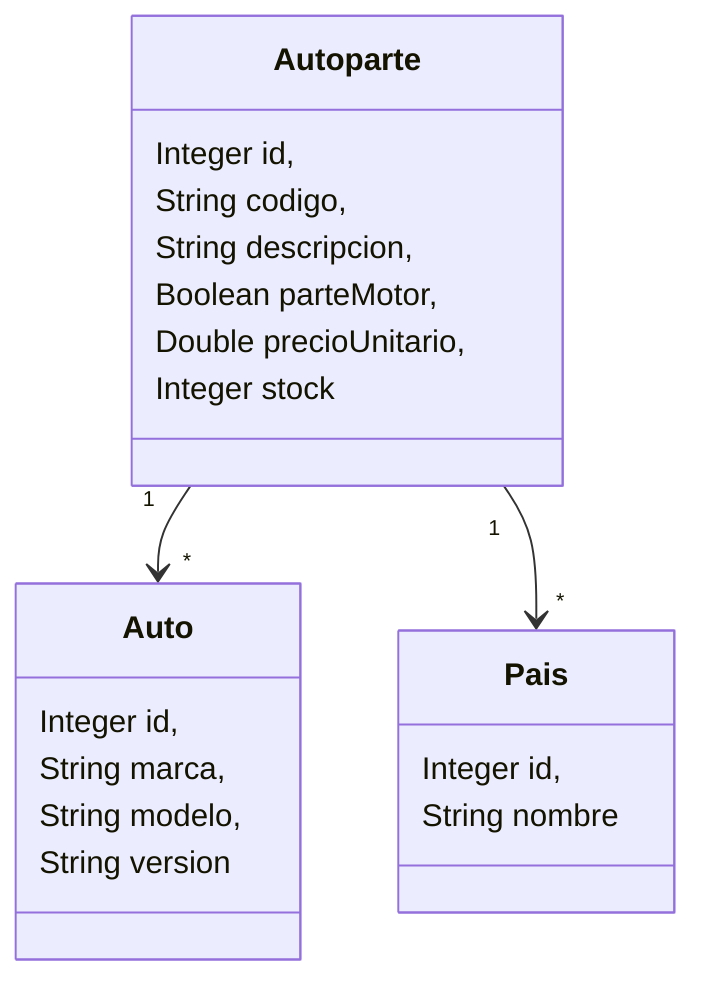

# Ejercicio de Spring - Servicio Web con elementos para el Parcial

## Propósito


Este laboratorio tiene por objectivo desarrollar un servicio web completo, con accesos a repositorios, usando bases de datos H2 y toda la potencia del Framework Spring para trabajar. El enunciado se trabajará en clases, pero se recomienda a los estudiantes que puedan realizar el paso a paso en sus casas para reforzar la práctica del mismo. 

La resolución del mismo se proveerá mediante un repositorio de GitLab, los alumnos pueden y deben para no romper dicho repositorio, clonarlo y hacer un branch, o clonarlo y luego desconectarlo de git borrando la carpter .git del directorio

## Pasos a desarrollar por el Alumno

1. Crear un repositorio, en caso de que no deseen clonar el que se proveerá, debe crearlo con vacio sin en REDAME ya que linkeará un folder del proyecto. (Se proveera el folder inicial comprimido)
   
2. Crear un proyecto web usando spring boot initializer con esta url __https://start.spring.io/__, su proyecto debe quedar como indica la imagen
    

3. Necesitamos tambien agregar todas las dependencias para trabajar con hibernate y Java Persistence API

```xml
        <dependency>
            <groupId>com.opencsv</groupId>
            <artifactId>opencsv</artifactId>
            <version>5.9</version> <!-- o la más nueva -->
        </dependency>
        <dependency>
            <groupId>org.hibernate</groupId>
            <artifactId>hibernate-core</artifactId>
            <version>7.0.2.Final</version>
        </dependency>
        <dependency>
            <groupId>io.ebean</groupId>
            <artifactId>jakarta-persistence-api</artifactId>
            <version>3.1</version>
        </dependency>
        <dependency>
            <groupId>com.h2database</groupId>
            <artifactId>h2</artifactId>
            <version>2.3.232</version>
        </dependency>
```

5. Likear el folder del proyecto al repositorio de ejecutando los siguientes comandos
   1. Inicializar el repositorio local  
        > __git init --initial-branch=main__
   2. Asociar el repositorio local al remoto que se creó el punto 1 
        > git remote add origin __SU_URL_GENERADA__
   3. Luego hacer el commit and push normalmente desde VS code o con los siguientes comandos
      1. > git add .
      2. > git commit -m "Initial commit"
      3. > git push --set-upstream origin main

## Enunciado Tipo Parcial

Una empresa de ventas de autopartes llamada "El Gitano" nos solicito un programa que permita el procesamiento de una archivo csv para realizar una serie de estadisticas generales. Las consultas seran hechas a través de un servicio web hecho en Spring, pero al iniciar la aplicación se deberá cargar el archivo csv en una base de datos. A partir de alli se llevarán a cabo una serie de puntos que retornarán la informacion que "el gitano" esta solicitando. 

1. Al ser una aplicacion web y como la importación se debe hacer al inicializar la aplicación se debe agregar la siguiente clase en config llama CsvLoader como lo indica la imagen
   
	

2. Siguiendo el mismo criterio, y con la necesidad de poder grabar en la base de datos usando los conocimientos que tienen hasta el momento generar la siguiente clase.
   
	

3. Agregar en resources la carpeta __META-INF__ para poder trabajar con JPA e Hibernate y dentro la capeta colocar el siguiente archivo __persistence.xml__

```xml
<?xml version="1.0" encoding="UTF-8"?>
<persistence xmlns="https://jakarta.ee/xml/ns/persistence"
    xmlns:xsi="http://www.w3.org/2001/XMLSchema-instance"
    xsi:schemaLocation="https://jakarta.ee/xml/ns/persistence https://jakarta.ee/xml/ns/persistence/persistence_3_0.xsd"
    version="3.0">

    <persistence-unit name="autopartista" transaction-type="RESOURCE_LOCAL">
        <!-- Your entity classes -->

        <properties>
            <!-- JDBC connection -->
            <property name="jakarta.persistence.jdbc.driver" value="org.h2.Driver" />
            <property name="jakarta.persistence.jdbc.url"
                value="jdbc:h2:file:./data/autopartes" />
            <property name="jakarta.persistence.jdbc.user" value="sa" />
            <property name="jakarta.persistence.jdbc.password" value="" />

            <!-- Hibernate as JPA provider -->
            <property name="hibernate.dialect" value="org.hibernate.dialect.H2Dialect" />
            <property name="hibernate.hbm2ddl.auto" value="update" /> <!-- create | create-drop |
            update | validate -->
            <property name="hibernate.show_sql" value="true" />
            <property name="hibernate.format_sql" value="true" />
        </properties>
    </persistence-unit>
</persistence>
```
4. Recuerde que para poder debe usar la siguiente linea de codigo para poder navegar el folder que ahora ademas del archivo csv contiene las imagene que esta viendo en este documento.

	> URI folderPath = CsvLoader.class.getResource("/static").toURI();

5. Las entidades que usted debe mapear son las siguientes:



6. Ahora si los puntos a desarrollar, haremos para cada punto un endpoint segun corresponda, a excecion del primer punto que se ejecuta al iniciarse la aplicacion:
   1. Importar todos los datos, procesando las lineas del csv, a la base de datos, con la siguiente considercion:
      1. La autoparte tiene que ser unica en la base, si una autoparte con el mismo codigo se procesa, no grabar esa autoparte, hacer un update de la misma para que se permita grabar sus relaciones
      2. Se debe mantener en memoria una unica instancia de Auto, si se procesa una linea que tiene ese auto entonces usar esa instancia, no generar uno nuevo, se considera que el auto es unico si la combinacion de marcar+modelo+version es unica
      3. se debe mantener en memoria una unica instancia de Pais, si se procesa una linea que tiene ese pais entonces usar esa instancia, no generar una nueva
   
   2. Informar Descripcion, Precio y cantidad en Stock de las autopartes, para un auto cuyo modelo sea un valor pasado como parametro

   3. Determinar el total de unidades en stock por cada pais de origen
   
   4. Informar el codigo, descripcion, pais de origen, modelo y version de todas aquellas autopartes de una marca pasada por parametro y con un stock mayor a otro valor pasado por parametro, ordenado por la descripcion de la autoparte
   
   5. Informar Codigo, descripcion y el costo total de tener el stock en la tienda, el costo total es el precioUnitario * stock, el listado se muestr ordenado de mayor a menor por el costo total de la autoparte 
   
   6. Agregar una nueva autoparte, ademas de los datos de la autoparte indicar el id del pais y el auto, tenga en cuenta las siguientes consideracion
      1. Si el id del pais no existe se debe lanzar una exception
      2. Si el id del auto no existe se debe lanzar una exception
      3. Si todo procede correctamente grabar la nueva autoparte